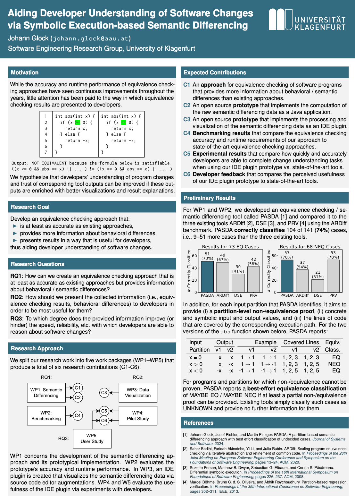

Poster for the ICSE 2024 Doctoral Symposium paper:  
[Aiding Developer Understanding of Software Changes via Symbolic Execution-based Semantic Differencing](https://conf.researchr.org/details/icse-2024/icse-2024-doctoral-symposium/3/Aiding-Developer-Understanding-of-Software-Changes-via-Symbolic-Execution-based-Seman)

The LaTeX sources for the paper itself can be found here:  
[ICSE 2024 Doctoral Symposium Paper](https://github.com/glockyco/icse2024-docsym-paper)

